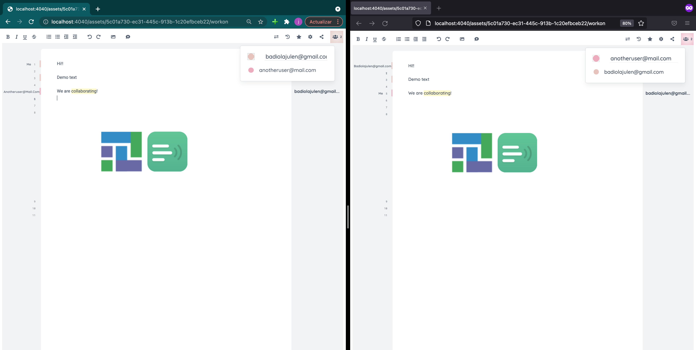

<div id="top"></div>

<!-- PROJECT LOGO -->
<br />
<div align="center">
  <a href="https://github.com/interlink-project/interlinker-collaborative-editor">
    
  </a>

  <h3 align="center">Collaborative editor interlinker</h3>

  <p align="center">
    Interlinker that allows multiple users to collaborate on real-time documents using Etherpad technology
    <br />
    <a href="https://interlink-project.eu/"><strong>View Interlink project »</strong></a>
    <br />
    <br />
    <a href="https://github.com/interlink-project/interlinker-collaborative-editor/issues">Report Bug</a>
    ·
    <a href="https://github.com/interlink-project/interlinker-collaborative-editor/issues">Request Feature</a>
  </p>
</div>


<!-- TABLE OF CONTENTS -->
<details>
  <summary>Table of Contents</summary>
  <ol>
    <li>
      <a href="#about-the-project">About The Project</a>
      <ul>
        <li><a href="#features">Features</a></li>
      </ul>
    </li>
    <li>
      <a href="#getting-started">Getting Started</a>
      <ul>
        <li><a href="#prerequisites">Prerequisites</a></li>
        <li><a href="#installation">Installation</a></li>
      </ul>
    </li>
    <li><a href="#usage">Usage</a></li>
    <li><a href="#contributing">Contributing</a></li>
  </ol>
</details>


<!-- ABOUT THE INTERLINKER -->
## About the Interlinker



This interlinker is intended to be a wrapper for the Etherpad open source tool. It consists of an API (developed with FastAPI) that acts as a proxy with Etherpad's own API (https://etherpad.org/doc/v1.8.4/), so that the specification of the project's interlinkers is followed and the agreed standard methods are provided.

<p align="right">(<a href="#top">back to top</a>)</p>

## Features

* Full **Docker** integration: 
    * Docker Swarm Mode deployment.
    * **Docker Compose** integration and optimization for local development.
    <p align="middle">
      
       
    </p>

    Diagram made with https://github.com/pmsipilot/docker-compose-viz
    
* **Production ready**:
    * **Uvicorn and Gunicorn**: Python web server.
    * **Traefik**: Load balancing and reverse proxy (http://localhost:8090/dashboard/#/). Includes Let's Encrypt **HTTPS** certificates automatic generation. 

  

* <a href="https://github.com/tiangolo/fastapi" class="external-link" target="_blank">**FastAPI**</a> backend:
    * **Fast**: Very high performance, on par with **NodeJS** and **Go** (thanks to Starlette and Pydantic).
    * **Intuitive**: Great editor support. <abbr title="also known as auto-complete, autocompletion, IntelliSense">Completion</abbr> everywhere. Less time debugging.
    * **Easy**: Designed to be easy to use and learn. Less time reading docs.
    * **Short**: Minimize code duplication. Multiple features from each parameter declaration.
    * **Robust**: Get production-ready code. With automatic interactive documentation.
    * **Standards-based**: Based on (and fully compatible with) the open standards for APIs: <a href="https://github.com/OAI/OpenAPI-Specification" class="external-link" target="_blank">OpenAPI</a> and <a href="http://json-schema.org/" class="external-link" target="_blank">JSON Schema</a>.
    * <a href="https://fastapi.tiangolo.com/features/" class="external-link" target="_blank">**Many other features**</a> including automatic validation, serialization, interactive documentation, authentication with OAuth2 JWT tokens, etc.

* **SQLAlchemy** models
    * **Alembic** migrations.
    * **PGAdmin** for PostgreSQL database. (http://localhost:5050/)

    

* **Other features** models
  * **CORS** (Cross Origin Resource Sharing).
  * **JWT token** authentication (access token obtained from OIDC).
  * **Pytest** integrated with Docker to test the full API interaction (independent on the database).

<p align="right">(<a href="#top">back to top</a>)</p>

<!-- GETTING STARTED -->
## Getting Started

To get a local copy up and running follow these simple example steps.

### Prerequisites

* Install [docker-compose](https://docs.docker.com/compose/install/) to run this project.

### Installation

1. Rename *.env.example* file to *.env* and set required data
2. Run the project
   ```sh
   docker-compose up --build -d
   ```

<p align="right">(<a href="#top">back to top</a>)</p>


<!-- USAGE EXAMPLES -->
## Usage

### Asset instantiation

>  POST to http://localhost/api/v1/assets/


### Asset retrieval

>  GET to http://localhost/api/v1/assets/{id}


### Editing interface

>  GET to http://localhost/api/v1/assets/{id}/workon


<p align="right">(<a href="#top">back to top</a>)</p>


<!-- CONTRIBUTING -->
## Contributing

Contributions are what make the open source community such an amazing place to learn, inspire, and create. Any contributions you make are **greatly appreciated**.

If you have a suggestion that would make this better, please fork the repo and create a pull request. You can also simply open an issue with the tag "enhancement".

1. Fork the Project
2. Create your Feature Branch (`git checkout -b feature/AmazingFeature`)
3. Commit your Changes (`git commit -m 'Add some AmazingFeature'`)
4. Push to the Branch (`git push origin feature/AmazingFeature`)
5. Open a Pull Request

<p align="right">(<a href="#top">back to top</a>)</p>